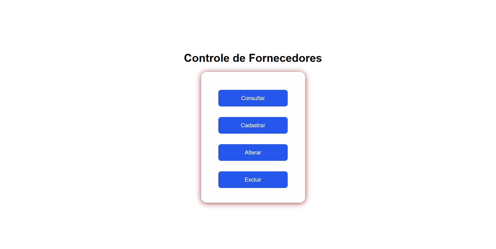
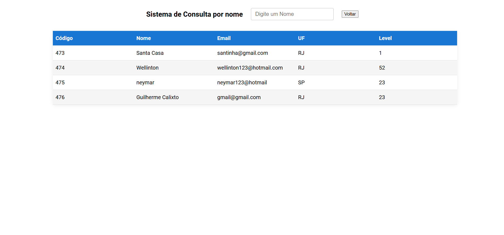

<h1 align="center">
  📦 Solicitações da Prefeitura
</h1>

<div align="center">

[](https://github.com/GuilhermeCalixto1)
[](https://github.com/GuilhermeCalixto1)

</div>

<p align="center">
  <b>Uma aplicação simples para cadastro, consulta e atualização de solicitações da prefeitura, com persistência em banco.</b>
</p>

<br>

## 📸 Preview do Projeto

<div align="center">
  
  
</div>

<br>

## 🔖 Sobre

O **Solicitações da Prefeitura** é uma aplicação voltada ao registro e acompanhamento de pedidos de serviço feitos por moradores.

Diferente de projetos estáticos, este sistema usa o **Supabase** como back-end e banco de dados, garantindo persistência e consulta em tempo real. O foco do desenvolvimento foi a performance (usando Vite) e a organização do fluxo de dados.

---

## 🚀 Tecnologias

O projeto foi desenvolvido com o que há de mais moderno no ecossistema JavaScript:

<div align="center">
  
  
  
  
  
  

</div>

---

## ⚙️ Funcionalidades

### 🔐 Funcionalidades

O sistema cobre todo o ciclo de vida da informação:

- [x] **🟢 Create:** Cadastro de solicitações com nome, bairro, tipo de serviço, descrição e status.
- [x] **🔵 Read:** Listagem de solicitações cadastradas com filtro por status.
- [x] **🟠 Update:** Alteração do status de uma solicitação.
- [x] **🗄️ Persistência:** Dados salvos no banco via Supabase.

### ✨ Diferenciais Técnicos

- **Consumo de API:** Tratamento de promessas com `Async/Await`.
- **Tratamento de Erros:** Blocos `try/catch` para capturar falhas de rede.
- **Performance:** Build otimizado pelo Vite.

---

## 💻 Instalação e Execução

Quer ver funcionando na sua máquina? Siga o passo a passo:

```bash
# 1. Clone o repositório
$ git clone https://github.com/GuilhermeCalixto1/Projeto-CRUD.git

# 2. Acesse a pasta do projeto
$ cd Projeto-CRUD

# 3. Instale as dependências (Node.js e Vite necessário)
$ npm install

# 4. Inicie o servidor de desenvolvimento
$ npm run frontend
```

## 👨‍💻 Autor

<div align="center">


<br>

<h3>Guilherme Calixto</h3> <p>Estudante de Engenharia de Software</p>

<a href="https://www.linkedin.com/in/guilhermecalixto1" target="_blank">

</a>

</div>
